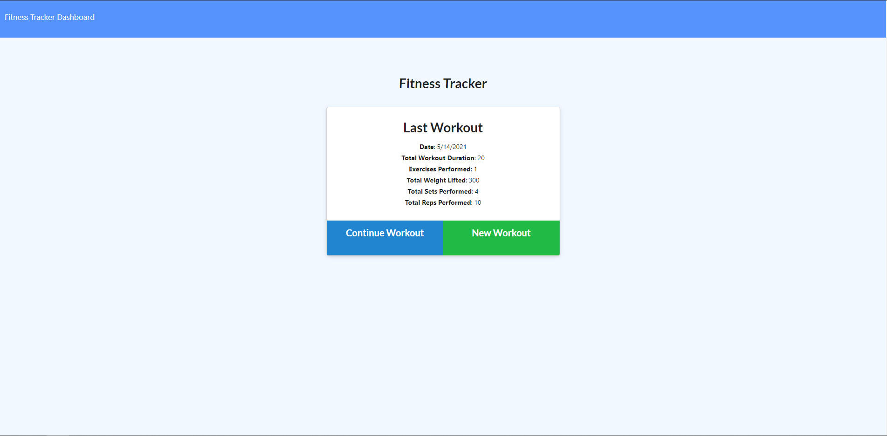
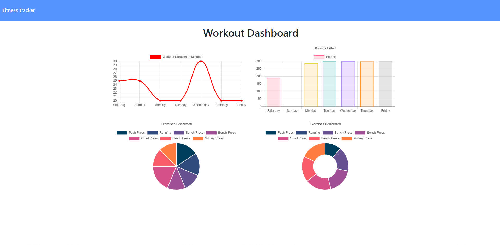

# Unit 17 NoSQL Homework: Workout Tracker

## Screenshots

## Deployed link

https://workout-tracker-gfs.herokuapp.com/

## Description

For this assignment, I was given the front end code for a workout tracking application and instructed to build the backend using a MongoDB database and Mongoose. On the front page, you can see the last workout saved (if there are any) and you can either continue that workout by adding exercises to it or start a new workout. If you do either, you'll be given a form in which you can fill in the details of your next exercise, and those details will be saved to the database. On the dashboard is the stats page, which can give you a visual representation of the last seven workouts you submitted, including the total duration and pounds lifted of each workout.

In doing this homework assignment, I learned a lot about using MongoDB for a website's back end. I also ran into a handful of issues in the front end code that was provided to me that I took the liberty to fix before deploying. It ended up being slightly more challening than I expected, but I learned a lot and feel it was a very valuable experience. I'm much more comfortable now with using MongoDB and Mongoose than I was before starting on this assignment.
